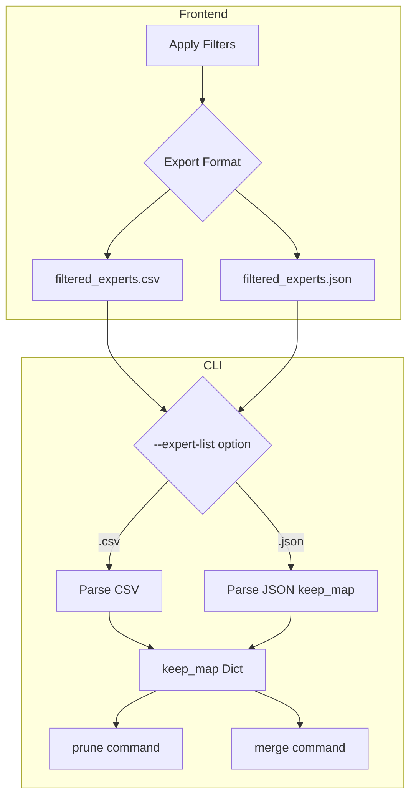

# Expert List Export and CLI Integration Plan

## Overview

Enable seamless workflow between frontend filtering and CLI prune/merge operations by:
1. Exporting filtered expert lists in both CSV (human-readable) and JSON (machine-readable keep_map) formats
2. Adding `--expert-list` option to CLI `prune` and `merge` commands to consume these exports

## Current State

### Frontend Export (existing)
- Location: [`frontend.py:export_filtered_results()`](src/mlx_fun/frontend.py:1376)
- Format: CSV only with columns `layer`, `expert`, `rank_sum`, `action`
- Actions: `keep`, `prune`, `merge`
- File: `filtered_experts.csv`

### CLI Commands (existing)
- [`prune`](src/mlx_fun/cli.py:97): Uses `--n-prune` to compute `keep_map` internally
- [`merge`](src/mlx_fun/cli.py:230): Uses `--n-prune` to compute `keep_map` internally
- Both support `--model-wide` flag for global selection

### Gap
Frontend exports filtering decisions, but CLI cannot consume them. Users must manually translate CSV data into CLI parameters.

---

## Proposed Architecture



---

## Implementation Details

### 1. Frontend: Enhanced Export Function

#### 1.1 Export Formats

**CSV Format** (human-readable, for inspection/manual editing):
```csv
layer,expert,rank_sum,action
0,0,45.0,keep
0,1,120.5,prune
0,2,89.2,keep
...
```

**JSON Format** (machine-readable keep_map, for CLI consumption):
```json
{
  "version": "1.0",
  "source": {
    "files": ["data/1.npz", "data/2.npz"],
    "metric": "reap",
    "selection_mode": "per_layer",
    "action_mode": "prune"
  },
  "filters": {
    "min_rank": null,
    "max_rank": null,
    "n_prune": 8
  },
  "keep_map": {
    "0": [0, 2, 3, 5, 6, 7, 8, 9],
    "1": [0, 1, 2, 3, 4, 5, 6, 7],
    ...
  },
  "statistics": {
    "num_layers": 61,
    "num_experts": 128,
    "total_kept": 7320,
    "total_pruned": 488
  }
}
```

#### 1.2 Modified `export_filtered_results()` Function

```python
def export_filtered_results(merge_data, min_rank, max_rank, n_prune, selection_mode, action_mode):
    """Export filtered expert list to CSV and JSON files.
    
    Exports two files:
    - filtered_experts.csv: Human-readable format for inspection
    - filtered_experts.json: Machine-readable keep_map for CLI consumption
    
    Returns:
        Tuple of (csv_path, json_path) for Gradio download
    """
    # ... existing filter logic ...
    
    # Build keep_map structure
    keep_map = {}
    for layer_idx in range(num_layers):
        kept = [expert_idx for expert_idx in range(num_experts) 
                if mask[layer_idx, expert_idx]]
        keep_map[str(layer_idx)] = sorted(kept)
    
    # Export CSV (existing logic)
    csv_path = "filtered_experts.csv"
    # ... write CSV ...
    
    # Export JSON (new)
    json_data = {
        "version": "1.0",
        "source": {
            "files": merge_data.get("files", []),
            "metric": merge_data.get("metric_key", "reap"),
            "selection_mode": selection_mode.lower().replace("-", "_"),
            "action_mode": action_mode.lower()
        },
        "filters": {
            "min_rank": min_rank,
            "max_rank": max_rank,
            "n_prune": n_prune
        },
        "keep_map": keep_map,
        "statistics": {
            "num_layers": num_layers,
            "num_experts": num_experts,
            "total_kept": sum(len(v) for v in keep_map.values()),
            "total_pruned": num_layers * num_experts - sum(len(v) for v in keep_map.values())
        }
    }
    
    json_path = "filtered_experts.json"
    with open(json_path, "w") as f:
        json.dump(json_data, f, indent=2)
    
    return csv_path, json_path
```

#### 1.3 UI Changes

Add second download button for JSON export:

```python
with gr.Row():
    export_csv_btn = gr.Button("Export CSV", variant="secondary")
    export_json_btn = gr.Button("Export JSON for CLI", variant="primary")

with gr.Row():
    csv_file = gr.File(label="CSV Export", visible=True)
    json_file = gr.File(label="JSON Export for CLI", visible=True)
```

---

### 2. Backend: Expert List Loader

#### 2.1 New Function in `pruner.py`

```python
def load_expert_list(
    expert_list_path: str,
) -> Dict[int, np.ndarray]:
    """Load expert list from CSV or JSON file and return keep_map.
    
    Supports two formats:
    - JSON: Direct keep_map format with layer indices as keys
    - CSV: Row format with layer, expert, action columns
    
    Args:
        expert_list_path: Path to .csv or .json file.
        
    Returns:
        Dict mapping layer_index -> numpy array of kept expert indices.
        
    Raises:
        ValueError: If file format is invalid or unsupported.
    """
    path = Path(expert_list_path)
    
    if path.suffix == ".json":
        return _load_expert_list_json(path)
    elif path.suffix == ".csv":
        return _load_expert_list_csv(path)
    else:
        raise ValueError(
            f"Unsupported file format: {path.suffix}. "
            "Use .json or .csv files."
        )


def _load_expert_list_json(path: Path) -> Dict[int, np.ndarray]:
    """Load keep_map from JSON format."""
    import json
    
    with open(path) as f:
        data = json.load(f)
    
    # Validate version
    version = data.get("version", "1.0")
    if version != "1.0":
        warnings.warn(f"Expert list version {version} may not be fully supported.")
    
    # Extract keep_map
    if "keep_map" not in data:
        raise ValueError("JSON file must contain 'keep_map' key")
    
    keep_map = data["keep_map"]
    return {
        int(layer_idx): np.array(experts, dtype=np.intp)
        for layer_idx, experts in keep_map.items()
    }


def _load_expert_list_csv(path: Path) -> Dict[int, np.ndarray]:
    """Load keep_map from CSV format.
    
    CSV must have columns: layer, expert, action
    Rows with action='keep' are included in keep_map.
    """
    import csv
    from collections import defaultdict
    
    keep_per_layer = defaultdict(list)
    
    with open(path, newline="") as f:
        reader = csv.DictReader(f)
        
        # Validate columns
        required = {"layer", "expert", "action"}
        if not required.issubset(set(reader.fieldnames or [])):
            raise ValueError(
                f"CSV must have columns: {required}. "
                f"Found: {reader.fieldnames}"
            )
        
        for row in reader:
            if row["action"].lower() == "keep":
                layer_idx = int(row["layer"])
                expert_idx = int(row["expert"])
                keep_per_layer[layer_idx].append(expert_idx)
    
    return {
        layer_idx: np.sort(np.array(experts, dtype=np.intp))
        for layer_idx, experts in keep_per_layer.items()
    }
```

---

### 3. CLI: Expert List Option

#### 3.1 Modified `prune` Command

```python
@main.command()
@click.option("--model", required=True, help="Model path or HuggingFace repo ID.")
@click.option("--saliency", default=None, help="Path to saliency .npz file.")
@click.option("--expert-list", default=None, 
              help="Path to expert list .json or .csv from frontend export. "
                   "Bypasses --n-prune calculation.")
@click.option("--output", required=True, help="Output directory for pruned model.")
@click.option("--n-prune", default=None, type=int, 
              help="Number of experts to prune per layer (or total if --model-wide). "
                   "Required if --expert-list is not provided.")
@click.option("--metric", default="reap", type=click.Choice(["reap", "ean", "freq", "weighted_freq"]))
@click.option("--strategy", default="bottom", type=click.Choice(["bottom", "strided"]))
@click.option("--model-wide", is_flag=True, default=False)
@click.option("--min-experts-per-layer", default=1, type=int)
@click.option("--safety-map", default=None)
@click.option("--safety-mode", default=None, type=click.Choice(["protect", "target"]))
@click.option("--domain-map", default=None)
@click.option("--domain-mode", default=None, type=click.Choice(["protect"]))
def prune(model, saliency, expert_list, output, n_prune, metric, strategy, 
          model_wide, min_experts_per_layer, safety_map, safety_mode, 
          domain_map, domain_mode):
    """Prune experts from model based on saliency statistics or expert list."""
    
    # Validate inputs
    if expert_list is None and saliency is None:
        raise click.UsageError(
            "Either --expert-list or --saliency must be provided."
        )
    if expert_list is None and n_prune is None:
        raise click.UsageError(
            "--n-prune is required when using --saliency."
        )
    if expert_list is not None and n_prune is not None:
        click.echo("Warning: --n-prune is ignored when --expert-list is provided.")
    
    # ... model loading ...
    
    # Determine keep_map source
    if expert_list:
        click.echo(f"Loading expert list from: {expert_list}")
        keep_map = load_expert_list(expert_list)
        click.echo(f"Loaded keep_map with {sum(len(v) for v in keep_map.values())} experts to keep")
    else:
        # Existing saliency-based logic
        click.echo(f"Loading saliency from: {saliency}")
        acc = SaliencyAccumulator.load(saliency)
        scores = acc.compute_scores(metric)
        
        # ... existing keep_map computation ...
    
    # ... rest of pruning logic ...
```

#### 3.2 Modified `merge` Command

Similar changes to the `merge` command:

```python
@main.command()
@click.option("--model", required=True, help="Model path or HuggingFace repo ID.")
@click.option("--saliency", default=None, help="Path to saliency .npz file.")
@click.option("--expert-list", default=None,
              help="Path to expert list .json or .csv from frontend export.")
@click.option("--dataset", required=True, help="Calibration dataset for merge.")
@click.option("--output", required=True, help="Output directory for merged model.")
@click.option("--n-prune", default=None, type=int,
              help="Number of experts to merge. Required if --expert-list not provided.")
@click.option("--metric", default="reap", type=click.Choice(["reap", "ean", "freq", "weighted_freq"]))
@click.option("--similarity-mode", default="gated", type=click.Choice(["gated", "average"]))
@click.option("--alignment", default="none", type=click.Choice(["none", "sign", "centroid"]))
@click.option("--max-group-size", default=4, type=int)
@click.option("--model-wide", is_flag=True, default=False)
@click.option("--min-experts-per-layer", default=1, type=int)
def merge(model, saliency, expert_list, dataset, output, n_prune, metric,
          similarity_mode, alignment, max_group_size, model_wide, min_experts_per_layer):
    """Merge experts using REAM algorithm based on saliency or expert list."""
    
    # Same validation and loading logic as prune command
    # ...
```

---

## Usage Examples

### Frontend Workflow

1. Open frontend: `mlx-fun ui`
2. Navigate to "Merge Mode Comparison" tab
3. Select saliency files and merge
4. Apply filters (min/max rank, N to prune, selection mode)
5. Click "Export JSON for CLI"
6. Download `filtered_experts.json`

### CLI Workflow with Expert List

```bash
# Prune using expert list from frontend
mlx-fun prune \
  --model ./my_model \
  --expert-list filtered_experts.json \
  --output ./pruned_model

# Merge using expert list from frontend
mlx-fun merge \
  --model ./my_model \
  --expert-list filtered_experts.json \
  --dataset calibration.jsonl \
  --output ./merged_model
```

### CLI Workflow with Saliency (existing)

```bash
# Existing workflow still works
mlx-fun prune \
  --model ./my_model \
  --saliency saliency.npz \
  --n-prune 8 \
  --output ./pruned_model
```

---

## File Format Specifications

### JSON Format v1.0

| Field | Type | Description |
|-------|------|-------------|
| `version` | string | Format version, always "1.0" |
| `source.files` | array | List of source .npz files used |
| `source.metric` | string | Metric used for ranking |
| `source.selection_mode` | string | "per_layer" or "model_wide" |
| `source.action_mode` | string | "analyze", "prune", or "merge" |
| `filters.min_rank` | number or null | Minimum rank sum filter |
| `filters.max_rank` | number or null | Maximum rank sum filter |
| `filters.n_prune` | number or null | Number of experts to prune |
| `keep_map` | object | Layer index to expert indices mapping |
| `statistics` | object | Summary statistics |

### CSV Format

| Column | Type | Description |
|--------|------|-------------|
| `layer` | integer | MoE layer index |
| `expert` | integer | Expert index within layer |
| `rank_sum` | float | Summed rank across source files |
| `action` | string | "keep", "prune", or "merge" |

---

## Implementation Checklist

### Frontend Changes
- [ ] Modify `export_filtered_results()` to generate both CSV and JSON
- [ ] Add JSON export button to UI
- [ ] Update download components to handle two files

### Backend Changes
- [ ] Add `load_expert_list()` function to `pruner.py`
- [ ] Add `_load_expert_list_json()` helper function
- [ ] Add `_load_expert_list_csv()` helper function
- [ ] Add unit tests for expert list loading

### CLI Changes
- [ ] Add `--expert-list` option to `prune` command
- [ ] Add `--expert-list` option to `merge` command
- [ ] Update input validation logic
- [ ] Add CLI tests for expert list option

### Documentation
- [ ] Update README with new workflow
- [ ] Add examples to CLI help text

---

## Testing Strategy

### Unit Tests

```python
# tests/test_pruner.py

def test_load_expert_list_json(tmp_path):
    """Test loading keep_map from JSON file."""
    json_data = {
        "version": "1.0",
        "keep_map": {
            "0": [0, 1, 2],
            "1": [0, 1, 3]
        }
    }
    json_path = tmp_path / "test.json"
    json_path.write_text(json.dumps(json_data))
    
    keep_map = load_expert_list(str(json_path))
    
    assert keep_map[0].tolist() == [0, 1, 2]
    assert keep_map[1].tolist() == [0, 1, 3]

def test_load_expert_list_csv(tmp_path):
    """Test loading keep_map from CSV file."""
    csv_content = "layer,expert,rank_sum,action\n0,0,10.0,keep\n0,1,20.0,prune\n1,0,15.0,keep\n"
    csv_path = tmp_path / "test.csv"
    csv_path.write_text(csv_content)
    
    keep_map = load_expert_list(str(csv_path))
    
    assert keep_map[0].tolist() == [0]
    assert keep_map[1].tolist() == [0]
```

### Integration Tests

```python
# tests/test_cli.py

def test_prune_with_expert_list(tmp_path, mock_model, expert_list_json):
    """Test prune command with --expert-list option."""
    result = runner.invoke(main, [
        "prune",
        "--model", str(mock_model),
        "--expert-list", str(expert_list_json),
        "--output", str(tmp_path / "output")
    ])
    
    assert result.exit_code == 0
    assert "Loading expert list" in result.output
```

---

## Backward Compatibility

- Existing CLI workflows using `--saliency` and `--n-prune` continue to work unchanged
- CSV export format remains the same for users who only need human-readable output
- JSON export is additive, not breaking

---

## Future Enhancements

1. **Expert List Validation**: Add validation to ensure expert list dimensions match model
2. **Partial Expert Lists**: Support specifying only certain layers (use saliency for others)
3. **Interactive Preview**: Show preview of what will be pruned/merged before execution
4. **Batch Operations**: Process multiple expert lists in one command
