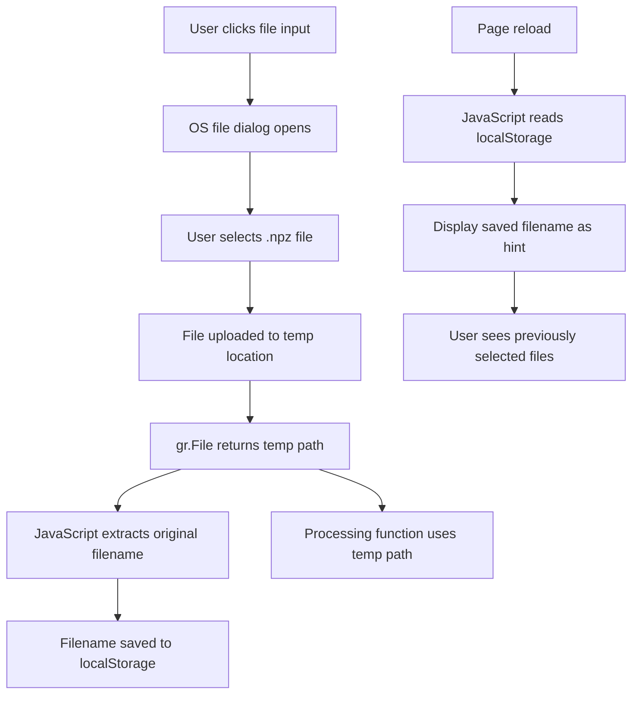

# File Selection Mode Refactoring Plan

## Overview

Refactor the file selection UI in the Gradio frontend to use native OS file dialogs via `gr.File()` component instead of the current textbox + dropdown combination. Additionally, implement localStorage persistence so selected file names are remembered across page reloads.

## Current Implementation

### Merge Mode Comparison Tab (lines 757-935)
- 4 file inputs: `merge_file1`, `merge_file2`, `merge_file3`, `merge_file4`
- Each uses:
  - `gr.Textbox` for manual path entry
  - `gr.Dropdown` for selecting from `data/` directory files
  - Clear button to reset

### Diff Analysis Tab (lines 1467-1530)
- 2 file inputs: `file1_input`, `file2_input`
- Same pattern: Textbox + Dropdown + Clear button

### Current Storage (lines 45-142)
- JavaScript function `get_local_storage_script()` exists
- Attempts to persist values but has issues with Gradio's DOM structure

## Proposed Changes

### 1. Replace File Input Components

**Before:**
```python
with gr.Row():
    merge_file1 = gr.Textbox(label="File 1 Path", elem_id="merge_file1")
    merge_file1_dropdown = gr.Dropdown(choices=data_files, label="Browse data/")
    merge_file1_clear = gr.Button("Clear")
```

**After:**
```python
with gr.Row():
    merge_file1 = gr.File(
        label="File 1 (.npz)",
        file_types=[".npz"],
        type="filepath",
        elem_id="merge_file1"
    )
```

### 2. Update File Processing Functions

The `merge_files_rank()` and `compare_files()` functions need to handle `gr.File()` output:

```python
def merge_files_rank(f1, f2, f3, f4, metric):
    # gr.File() returns file path string when type="filepath"
    # Filter out None values from unselected files
    files = [f for f in [f1, f2, f3, f4] if f is not None]
    # Rest of the logic remains the same
```

### 3. localStorage Persistence Strategy

Since `gr.File()` uploads files to temp locations, we need to:
1. Store the **original filename** in localStorage (for display purposes)
2. Use the **temp filepath** for actual processing

**JavaScript Implementation:**
```javascript
// Store original filename when file is selected
function saveFileName(inputId, fileName) {
    localStorage.setItem('mlx_fun_' + inputId, fileName);
}

// Load and display saved filename on page load
function loadFileName(inputId) {
    return localStorage.getItem('mlx_fun_' + inputId) || '';
}
```

**Gradio Integration:**
- Use `gr.HTML()` to inject JavaScript that:
  1. Listens for file input changes
  2. Extracts original filename from the file input
  3. Saves to localStorage
  4. Displays saved filename as a hint/placeholder

### 4. UI Enhancement - Show Saved File Names

Add a display area showing previously selected files:

```python
gr.Markdown("**Previously selected files:**")
saved_files_display = gr.Markdown("", elem_id="saved_files_display")
```

Update via JavaScript to show saved filenames on load.

## Files to Modify

| File | Changes |
|------|---------|
| `src/mlx_fun/frontend.py` | Replace textbox/dropdown with gr.File, update handlers, enhance localStorage JS |

## Implementation Steps

### Step 1: Replace Merge Mode Tab File Inputs
- Remove `gr.Textbox`, `gr.Dropdown`, and Clear buttons
- Add `gr.File` components with `file_types=[".npz"]` and `type="filepath"`
- Update elem_ids for localStorage tracking

### Step 2: Replace Diff Analysis Tab File Inputs
- Same pattern as Step 1

### Step 3: Update Processing Functions
- Modify `merge_files_rank()` to handle `None` values from unselected files
- Modify `compare_files()` similarly
- No path extraction changes needed since `type="filepath"` returns usable paths

### Step 4: Implement Enhanced localStorage
- Create new JavaScript function for file name persistence
- Handle Gradio's file input DOM structure
- Display saved filenames on page load

### Step 5: Remove Obsolete Code
- Remove `get_data_directory_files()` function (no longer needed)
- Remove old `get_local_storage_script()` function
- Clean up unused dropdown wiring

## Technical Considerations

### gr.File Behavior
- `type="filepath"`: Returns temp file path (e.g., `/tmp/gradio/abc123.npz`)
- `file_types=[".npz"]`: Filters dialog to show only .npz files
- Returns `None` if no file selected

### Browser Security Limitations
- Cannot auto-populate file inputs from localStorage (browser security)
- Can only display the saved filename as a hint
- User must re-select file after page reload

### Temp File Handling
- Gradio handles temp file cleanup automatically
- Temp paths are valid for the session duration
- Original filename is lost after upload (only temp path available)

## Code Flow Diagram



## Testing Checklist

- [ ] File selection opens OS dialog
- [ ] Only .npz files are filterable in dialog
- [ ] Selected files are processed correctly
- [ ] File names appear in localStorage
- [ ] Page reload shows previously selected filenames
- [ ] Multiple file selection works in Merge tab
- [ ] Diff tab file selection works independently
- [ ] Clear/reset functionality works
- [ ] Error handling for invalid files

## Estimated Changes

| Section | Lines Changed |
|---------|---------------|
| Merge Mode file inputs | ~60 lines removed, ~20 added |
| Diff Analysis file inputs | ~30 lines removed, ~10 added |
| localStorage JavaScript | ~50 lines modified |
| Processing functions | ~10 lines modified |
| Cleanup | ~10 lines removed |

**Net change:** Approximately -50 lines (code simplification)
