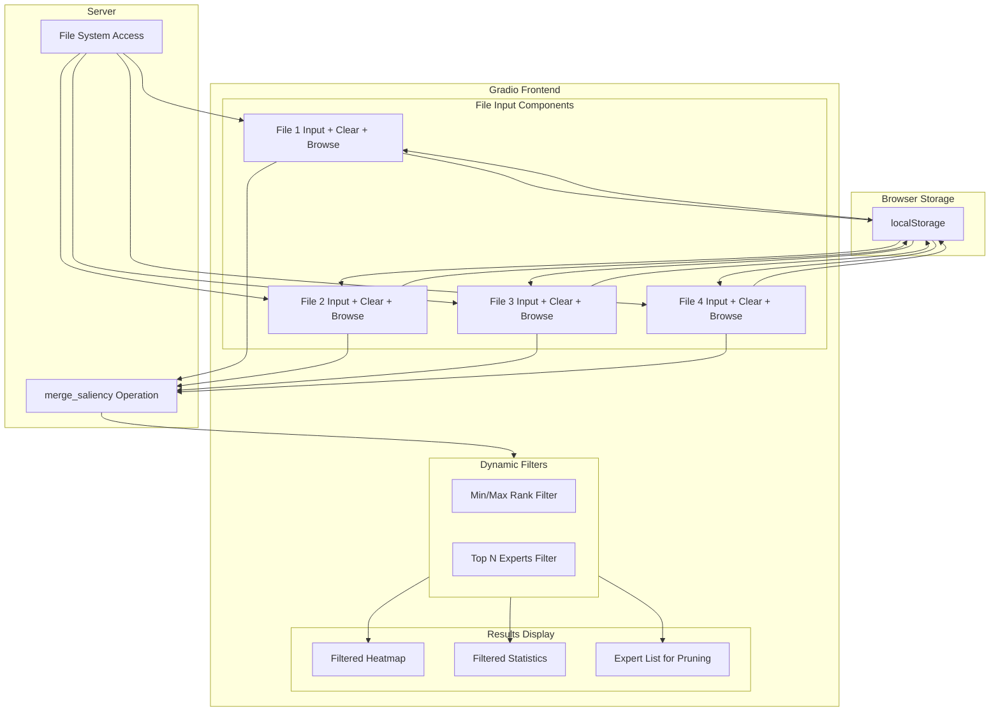

# Frontend Enhancements Plan

## Overview

This plan covers three major enhancements to the Gradio frontend:

1. **Persistent File Inputs** - Retain file paths across page refreshes
2. **File Input Controls** - Add Clear and Browse buttons
3. **Dynamic Filtering** - Add rank-based filtering on Merge Mode Comparison page

---

## 1. Persistent File Inputs

### Problem
Currently, when the user refreshes the page, all file input values are lost. Users have to re-enter file paths manually.

### Solution Options

#### Option A: Browser LocalStorage (Recommended)
Store file paths in the browser's localStorage using Gradio's JavaScript integration.

**Pros:**
- Client-side only, no backend changes needed
- Persists across sessions
- Fast and simple

**Cons:**
- Limited to same browser/device
- Requires custom JavaScript

**Implementation:**
```javascript
// Save to localStorage when inputs change
// Load from localStorage on page load
// Use gr.HTML component to inject JavaScript
```

#### Option B: Backend Config File
Store file paths in a JSON config file on the server.

**Pros:**
- Works across different browsers/devices
- Can be version controlled

**Cons:**
- Requires backend API changes
- More complex implementation

### Recommended Approach: Option A (Browser LocalStorage)

Use Gradio's `gr.HTML` component to inject custom JavaScript that:
1. Saves file input values to localStorage when they change
2. Restores values from localStorage when the page loads
3. Provides a "Clear Storage" button if needed

---

## 2. File Input Controls

### Current State
File inputs are simple `gr.Textbox` components where users must type paths manually.

### Enhancements

#### 2.1 Clear Button
Add a button next to each file input that clears the text.

**Implementation:**
```python
with gr.Row():
    file_input = gr.Textbox(label="File Path", scale=4)
    clear_btn = gr.Button("Clear", scale=1, variant="secondary")
    clear_btn.click(lambda: "", outputs=[file_input])
```

#### 2.2 File Browse Button
Add a file browser button to select .npz files from the server's filesystem.

**Implementation:**
```python
with gr.Row():
    file_input = gr.Textbox(label="File Path", scale=3)
    file_browser = gr.FileBrowser(
        file_count="single",
        file_types=[".npz"],
        label="Browse"
    )
    clear_btn = gr.Button("Clear", scale=1)
```

**Note:** Gradio's `gr.File` or browser component needs server-side file access. The `data/` directory should be accessible.

---

## 3. Dynamic Filtering on Merge Mode Comparison

### Current State
The Merge Mode Comparison page shows all experts in the heatmap without filtering.

### New Filtering Capabilities

#### 3.1 Rank Sum Threshold Filter (Min/Max)
Allow users to filter experts based on their summed rank values.

**UI Components:**
```python
with gr.Row():
    rank_min = gr.Number(label="Min Rank Sum", value=None)
    rank_max = gr.Number(label="Max Rank Sum", value=None)
```

**Behavior:**
- If Min is set: Only show experts with rank_sum >= min
- If Max is set: Only show experts with rank_sum <= max
- Lower rank_sum = more important expert

#### 3.2 N-Experts Filter (Top N for Pruning)
Show only the top N experts with the lowest ratings (best candidates for pruning).

**UI Components:**
```python
with gr.Row():
    show_top_n = gr.Number(
        label="Show Top N Experts (Lowest Rank = Best to Prune)",
        value=None,
        precision=0
    )
```

**Behavior:**
- If N=50: Show only the 50 experts with the lowest rank sums
- These are the most consistently important experts across all files
- Useful for identifying which experts to KEEP (not prune)

#### 3.3 Filtered Heatmap Display
The heatmap should update dynamically to show only filtered experts.

**Implementation Approach:**
- Create a mask based on filter criteria
- Apply mask to the summed_ranks array
- Update heatmap visualization
- Show filtered statistics

---

## Architecture Diagram



---

## Implementation Details

### File Changes Required

#### `src/mlx_fun/frontend.py`

1. **Add JavaScript for localStorage persistence**
   - Add `gr.HTML` component with inline JavaScript
   - Handle save/load of file input values

2. **Update file input rows**
   - Wrap each file input in a Row with Clear button
   - Add FileBrowser component for file selection

3. **Add filter controls to Merge Mode Comparison tab**
   - Add Min/Max rank sum inputs
   - Add Top N experts input
   - Add Apply Filters button

4. **Update `merge_files_rank` function**
   - Accept filter parameters
   - Apply filters to results
   - Return filtered heatmap and statistics

### New Components

```python
# LocalStorage persistence
def get_local_storage_script():
    return """
    <script>
    function saveFileInputs() {
        const inputs = ['merge_file1', 'merge_file2', 'merge_file3', 'merge_file4',
                        'diff_file1', 'diff_file2'];
        inputs.forEach(id => {
            const el = document.querySelector(`#${id} input`);
            if (el) {
                localStorage.setItem(id, el.value);
                el.addEventListener('input', () => {
                    localStorage.setItem(id, el.value);
                });
            }
        });
    }
    function loadFileInputs() {
        const inputs = ['merge_file1', 'merge_file2', 'merge_file3', 'merge_file4',
                        'diff_file1', 'diff_file2'];
        inputs.forEach(id => {
            const el = document.querySelector(`#${id} input`);
            if (el) {
                const saved = localStorage.getItem(id);
                if (saved) el.value = saved;
            }
        });
    }
    setTimeout(() => { loadFileInputs(); saveFileInputs(); }, 500);
    </script>
    """

# Filter controls
with gr.Row():
    rank_min_filter = gr.Number(
        label="Min Rank Sum (leave empty for no min)",
        value=None,
        precision=0
    )
    rank_max_filter = gr.Number(
        label="Max Rank Sum (leave empty for no max)",
        value=None,
        precision=0
    )
    top_n_filter = gr.Number(
        label="Show Top N Experts (lowest rank = most important)",
        value=None,
        precision=0
    )

# Apply filters button
apply_filters_btn = gr.Button("Apply Filters", variant="secondary")
```

### Filtered Output Display

When filters are applied:
1. Show count of experts matching filter criteria
2. Display filtered heatmap (masked array)
3. List top experts that match criteria
4. Provide exportable list for pruning decisions

---

## UI Layout

```
┌─────────────────────────────────────────────────────────────────┐
│ Merge Mode Comparison                                           │
├─────────────────────────────────────────────────────────────────┤
│                                                                 │
│ Input Files                                                     │
│ ┌──────────────────────────────────────┐ ┌────┐ ┌────────────┐ │
│ │ File 1 Path (.npz)                   │ │Clear│ │ Browse... │ │
│ └──────────────────────────────────────┘ └────┘ └────────────┘ │
│ ┌──────────────────────────────────────┐ ┌────┐ ┌────────────┐ │
│ │ File 2 Path (.npz)                   │ │Clear│ │ Browse... │ │
│ └──────────────────────────────────────┘ └────┘ └────────────┘ │
│ ┌──────────────────────────────────────┐ ┌────┐ ┌────────────┐ │
│ │ File 3 Path (.npz, optional)         │ │Clear│ │ Browse... │ │
│ └──────────────────────────────────────┘ └────┘ └────────────┘ │
│ ┌──────────────────────────────────────┐ ┌────┐ ┌────────────┐ │
│ │ File 4 Path (.npz, optional)         │ │Clear│ │ Browse... │ │
│ └──────────────────────────────────────┘ └────┘ └────────────┘ │
│                                                                 │
│ [Merge Files]                                                   │
│                                                                 │
│ ─────────────────────────────────────────────────────────────── │
│                                                                 │
│ Dynamic Filters                                                 │
│ ┌─────────────────┐ ┌─────────────────┐ ┌─────────────────────┐ │
│ │ Min Rank Sum    │ │ Max Rank Sum    │ │ Top N Experts       │ │
│ │ [            ]  │ │ [            ]  │ │ [                ]  │ │
│ └─────────────────┘ └─────────────────┘ └─────────────────────┘ │
│                                                                 │
│ [Apply Filters]  [Reset Filters]                                │
│                                                                 │
│ ─────────────────────────────────────────────────────────────── │
│                                                                 │
│ Results: 150 experts match filters (out of 1408 total)          │
│                                                                 │
│ ┌─────────────────────────────────────────────────────────────┐ │
│ │                                                             │ │
│ │              [Filtered Heatmap Visualization]               │ │
│ │                                                             │ │
│ └─────────────────────────────────────────────────────────────┘ │
│                                                                 │
│ Top 5 Experts to KEEP (lowest rank sum):                        │
│   1. Layer 12, Expert 45: rank sum = 8                          │
│   2. Layer 8, Expert 23: rank sum = 12                          │
│   3. ...                                                        │
│                                                                 │
│ [Statistics JSON]                                               │
└─────────────────────────────────────────────────────────────────┘
```

---

## Tasks Breakdown

### Phase 1: File Input Enhancements
1. Add Clear button to each file input field
2. Add FileBrowser component for .npz file selection
3. Implement localStorage persistence via JavaScript injection

### Phase 2: Dynamic Filtering
4. Add Min/Max rank sum filter inputs
5. Add Top N experts filter input
6. Update merge_files_rank function to accept filter parameters
7. Create filtered heatmap visualization
8. Add filtered statistics display

### Phase 3: Polish
9. Add Reset Filters button
10. Add expert count display (matching vs total)
11. Test all features with real data

---

## Questions for Clarification

1. **File Browser Scope:** Should the file browser be limited to the `data/` directory, or allow browsing the entire filesystem?

2. **Filter Persistence:** Should filter values also persist across page refreshes (stored in localStorage)?

3. **Export Feature:** Would you like an export button to save the filtered expert list to a file?
