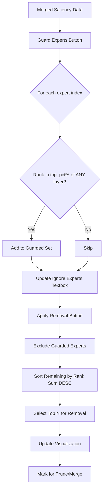

# Guard Experts Feature Plan

## Status: ✅ IMPLEMENTED (Updated to check individual NPZ files)

## Overview

Add a "Guard Experts" feature to the frontend that automatically identifies and protects important experts based on **per-file** per-layer ranking thresholds, then selects N additional experts for pruning/merging from the remaining pool.

## Key Change: Individual File Rankings

The guard logic now checks **each individual NPZ file's rankings**, not the merged/summed ranks. An expert is guarded if it ranks in the top X% in ANY layer of ANY NPZ file.

## User Workflow

1. User merges saliency files to get rank sums across multiple datasets
2. User enters a **Top Percent** value (e.g., 10 for top 10%)
3. User clicks **Guard Experts** button
4. System scans **each individual NPZ file** for each expert index:
   - For each file, check if expert ranks in top top_pct% in ANY layer
   - Example: 10% of 256 experts = threshold of 25
   - If expert 5 has rank ≤ 25 in ANY layer of ANY file, expert 5 gets guarded
5. Guarded experts are automatically added to the "Ignore Experts" textbox
6. User enters **N to Remove** value
7. System selects N experts with highest rank sums (least important) from non-guarded pool
8. Selected experts are marked for pruning/merging

## UI Changes

### New Input Fields

```
#### Guard Experts
[Top Percent %]  [Guard Experts Button]

#### Expert Removal  
[N to Remove]     [Apply Removal Button]
```

### Layout Position

Add after the "Ignore Experts" textbox and before "Dynamic Filters" section:

```
#### Selection Mode
[Per-Layer] [Model-Wide]

#### Ignore Experts (Model-Wide only)
[e.g., 1,2,250..255]

#### Guard Experts (Model-Wide only)
[Top Percent % input] [Guard Experts Button]

#### Expert Removal
[N to Remove input] [Apply Removal Button]

---
#### Dynamic Filters
...
```

## Implementation Details

### 1. Guard Experts Function

```python
def guard_experts_by_top_percent(
    summed_ranks: np.ndarray,
    top_pct: float,
) -> set:
    """Find experts to guard based on per-layer top percentile ranking.
    
    An expert is guarded if it ranks in the top top_pct% in ANY layer.
    Since lower rank sum = more important, we check if rank < threshold.
    
    Args:
        summed_ranks: (num_layers, num_experts) array of rank sums
        top_pct: Percentage threshold (e.g., 10 for top 10%)
    
    Returns:
        Set of expert indices to guard
    """
    num_layers, num_experts = summed_ranks.shape
    threshold = int(top_pct / 100 * num_experts)
    
    guarded = set()
    for expert_idx in range(num_experts):
        # Check this expert's rank in all layers
        for layer_idx in range(num_layers):
            # Get rank of this expert in this layer
            layer_ranks = summed_ranks[layer_idx]
            expert_rank = layer_ranks[expert_idx]
            
            # Count how many experts have lower (better) rank
            better_count = (layer_ranks < expert_rank).sum()
            
            # If in top top_pct%, guard this expert
            if better_count < threshold:
                guarded.add(expert_idx)
                break  # No need to check other layers
    
    return guarded
```

### 2. Select N Experts for Removal

```python
def select_n_experts_for_removal(
    summed_ranks: np.ndarray,
    guarded_experts: set,
    n_remove: int,
) -> list:
    """Select N least important experts from non-guarded pool.
    
    Args:
        summed_ranks: (num_layers, num_experts) array of rank sums
        guarded_experts: Set of expert indices to exclude
        n_remove: Number of experts to select for removal
    
    Returns:
        List of expert indices selected for pruning/merging
    """
    num_experts = summed_ranks.shape[1]
    
    # Build list of non-guarded experts with their total scores
    candidates = []
    for expert_idx in range(num_experts):
        if expert_idx not in guarded_experts:
            # Sum across all layers (higher = less important)
            total_score = summed_ranks[:, expert_idx].sum()
            candidates.append((expert_idx, total_score))
    
    # Sort by score descending (highest first = least important)
    candidates.sort(key=lambda x: x[1], reverse=True)
    
    # Return top N expert indices
    return [idx for idx, _ in candidates[:n_remove]]
```

### 3. Frontend Integration

The Guard Experts button should:

1. Read current merged data from state
2. Call `guard_experts_by_top_percent()` with top_pct value
3. Update the "Ignore Experts" textbox with the guarded expert indices
4. Show a status message with count of guarded experts

The Apply Removal button should:

1. Read current merged data and ignored experts
2. Call `select_n_experts_for_removal()` with n_remove value
3. Update the visualization to highlight selected experts
4. Update the statistics JSON with removal information

## Data Flow Diagram



## Files to Modify

### src/mlx_fun/frontend.py
- Add new input fields: `top_pct_input`, `n_remove_input`
- Add `guard_experts_btn` button
- Add `apply_removal_btn` button  
- Implement `guard_experts_callback()` function
- Implement `apply_removal_callback()` function
- Update `apply_filters()` to respect guarded + removal logic

### tests/test_frontend.py
- Add tests for guard_experts_by_top_percent logic
- Add tests for select_n_experts_for_removal logic

## Edge Cases

1. **top_pct = 0**: No experts guarded
2. **top_pct = 100**: All experts guarded
3. **n_remove > available experts**: Cap at available count, show warning
4. **All experts guarded**: Show error, cannot remove any
5. **No merged data**: Disable buttons, show message

## Example Usage

```
Input:
- 50 layers, 256 experts
- top_pct = 10
- n_remove = 20

Process:
1. Threshold = 10% of 256 = 25
2. For each expert 0-255:
   - Check if rank < 25 in any of 50 layers
   - If yes, add to guarded set
3. Suppose 30 experts are guarded
4. Remaining candidates = 256 - 30 = 226
5. Sort 226 by total rank sum descending
6. Select top 20 for removal

Output:
- Ignore Experts textbox: "5,12,23,..." (30 guarded experts)
- 20 experts marked for pruning/merging
```
