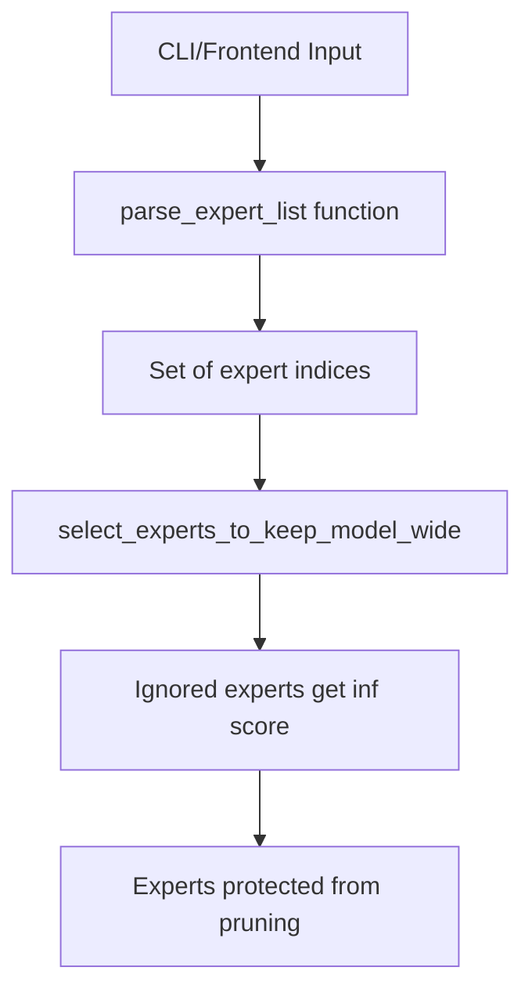

# Ignore Experts Feature Plan

## Overview

Add an `--ignore-experts` option that allows specifying expert indices to protect from model-wide pruning. When using `--model-wide` mode, these experts will never be pruned from any layer.

## Input Format

The input format supports:
- **Individual experts**: `1,2,5` → experts 1, 2, and 5
- **Ranges**: `250..255` → experts 250, 251, 252, 253, 254, 255
- **Combined**: `1,2,250..255` → experts 1, 2, 250, 251, 252, 253, 254, 255

## Architecture



## Implementation Details

### 1. Parsing Function - `pruner.py`

Add a new utility function:

```python
def parse_expert_list(expert_spec: str) -> set[int]:
    """Parse expert specification string into a set of indices.
    
    Supports:
    - Individual indices: 1,2,5
    - Ranges: 250..255
    - Combined: 1,2,250..255
    
    Args:
        expert_spec: Comma-separated list of indices or ranges
        
    Returns:
        Set of expert indices
        
    Raises:
        ValueError: If format is invalid
    """
```

**Parsing Logic:**
1. Split by comma
2. For each part:
   - If contains `..`, parse as range (start..end inclusive)
   - Otherwise, parse as single integer
3. Return sorted set of all indices

### 2. CLI Option - `cli.py`

Add to both `prune` and `merge` commands:

```python
@click.option("--ignore-experts", default=None,
              help="Comma-separated expert indices to ignore during model-wide pruning. "
                   "Format: 1,2,250..255 (ranges inclusive). Only valid with --model-wide.")
```

**Validation:**
- Only valid when `--model-wide` is set
- Raise `UsageError` if used without `--model-wide`

### 3. Model-Wide Selection Update - `pruner.py`

Modify [`select_experts_to_keep_model_wide`](../src/mlx_fun/pruner.py:206) to accept `ignored_experts`:

```python
def select_experts_to_keep_model_wide(
    scores: np.ndarray,
    n_prune_total: int,
    protected_experts: Dict[int, np.ndarray] = None,
    targeted_experts: Dict[int, np.ndarray] = None,
    min_experts_per_layer: int = 1,
    ignored_experts: set[int] = None,  # NEW
) -> Dict[int, np.ndarray]:
```

**Logic:**
- Add `ignored_experts` to the protection logic similar to `protected_experts`
- Set `column_scores[ignored_experts] = np.inf` to prevent pruning

### 4. Frontend UI - `frontend.py`

Add a text input component in the model-wide selection UI:

```python
gr.Textbox(
    label="Ignore Experts",
    placeholder="1,2,250..255",
    info="Expert indices to protect from model-wide pruning"
)
```

**Integration:**
- Only show when `selection_mode == "Model-Wide"`
- Parse using the same `parse_expert_list` function
- Pass to filtering logic

### 5. Tests - `tests/test_pruner.py`

Add test cases:

```python
class TestParseExpertList:
    def test_single_index(self):
        assert parse_expert_list("5") == {5}
    
    def test_multiple_indices(self):
        assert parse_expert_list("1,2,5") == {1, 2, 5}
    
    def test_range(self):
        assert parse_expert_list("250..255") == {250, 251, 252, 253, 254, 255}
    
    def test_combined(self):
        assert parse_expert_list("1,2,250..255") == {1, 2, 250, 251, 252, 253, 254, 255}
    
    def test_whitespace_tolerance(self):
        assert parse_expert_list("1, 2, 250..255") == {1, 2, 250, 251, 252, 253, 254, 255}
    
    def test_invalid_format(self):
        with pytest.raises(ValueError):
            parse_expert_list("abc")

class TestModelWideWithIgnoredExperts:
    def test_ignored_experts_not_pruned(self):
        # Test that ignored experts are kept
        pass
    
    def test_ignored_experts_with_safety_constraints(self):
        # Test interaction with protected_experts
        pass
```

## Files to Modify

| File | Changes |
|------|---------|
| [`src/mlx_fun/pruner.py`](../src/mlx_fun/pruner.py) | Add `parse_expert_list` function, update `select_experts_to_keep_model_wide` |
| [`src/mlx_fun/cli.py`](../src/mlx_fun/cli.py) | Add `--ignore-experts` option to `prune` and `merge` commands |
| [`src/mlx_fun/frontend.py`](../src/mlx_fun/frontend.py) | Add ignore experts textbox in model-wide UI |
| [`tests/test_pruner.py`](../tests/test_pruner.py) | Add tests for new functionality |
| [`README.md`](../README.md) | Document the new option |

## Usage Examples

### CLI

```bash
# Prune 50 experts globally but keep experts 0,1,2 and 250-255
mlx-fun prune --model ./model --saliency stats.npz \
    --model-wide --n-prune 50 \
    --ignore-experts "0,1,2,250..255" \
    --output ./pruned

# Merge with ignored experts
mlx-fun merge --model ./model --saliency stats.npz --dataset calib.jsonl \
    --model-wide --n-prune 50 \
    --ignore-experts "0,1,2,250..255" \
    --output ./merged
```

### Frontend

In the Model-Wide selection mode, users can enter expert indices in a text box to protect them from pruning.

## Edge Cases

1. **Empty string**: Should return empty set (no experts ignored)
2. **Invalid format**: Raise clear ValueError with message
3. **Out of range indices**: Warn but continue (expert may not exist in all models)
4. **Duplicate indices**: Handle gracefully (set automatically deduplicates)
5. **Whitespace**: Should be tolerant of spaces around commas

## Interaction with Existing Constraints

The `--ignore-experts` option works alongside existing constraints:
- **protected_experts** (from safety/domain maps): Union with ignored_experts
- **targeted_experts**: Targeted takes precedence (if an expert is both targeted and ignored, it will be targeted)

Priority order (highest wins):
1. `targeted_experts` → always prune
2. `protected_experts` + `ignored_experts` → never prune
