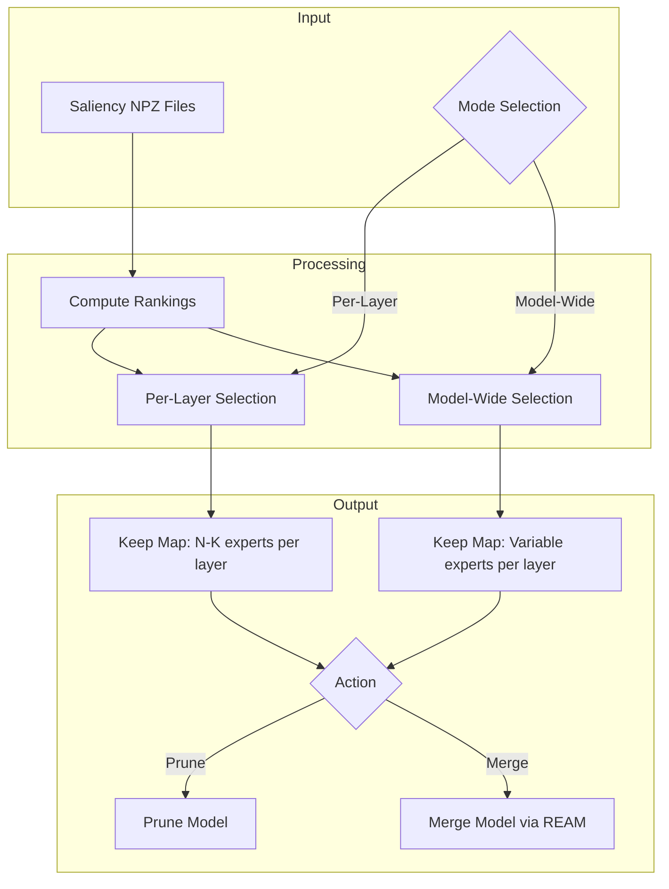

# Model-Wide Pruning/Merging Mode Plan

## Overview

Add support for model-wide expert selection where N experts with the lowest (worst) ratings are selected globally across all layers, rather than per-layer. This mode will be available in both CLI commands and reflected in the frontend visualization.

## Current Behavior vs New Behavior

### Current (Per-Layer Mode)
- For each layer independently: select N experts with lowest scores to prune/merge
- Result: Every layer has exactly N experts removed
- Total experts removed: `N × num_layers`

### New (Model-Wide Mode)
- Across all layers globally: select N experts with lowest scores
- Result: Uneven distribution - some layers may lose more experts than others
- Total experts removed: N (globally)

## Architecture



## Implementation Details

### 1. Backend Changes

#### 1.1 pruner.py - Add `select_experts_to_keep_model_wide`

```python
def select_experts_to_keep_model_wide(
    scores: np.ndarray,
    n_prune_total: int,
    protected_experts: Dict[int, np.ndarray] = None,
    targeted_experts: Dict[int, np.ndarray] = None,
) -> Dict[int, np.ndarray]:
    """Select experts to keep using model-wide selection.
    
    Instead of pruning N experts per layer, this selects N experts globally
    across all layers based on lowest saliency scores.
    
    Args:
        scores: (num_layers, num_experts) saliency scores. Higher = more important.
        n_prune_total: Total number of experts to prune across entire model.
        protected_experts: Optional dict mapping layer_idx -> expert IDs to never prune.
        targeted_experts: Optional dict mapping layer_idx -> expert IDs to always prune.
    
    Returns:
        Dict mapping layer_index -> numpy array of kept expert indices (sorted).
    """
```

**Algorithm:**
1. Flatten all scores into a single array with (layer, expert) indices
2. Apply protected/targeted constraints (protected get inf, targeted get -inf)
3. Find N lowest-scoring experts globally
4. Build keep_map by excluding selected experts from each layer

#### 1.2 stats_ops.py - Add model-wide ranking support

Add function to compute model-wide rankings for visualization:

```python
def compute_model_wide_ranks(
    acc: SaliencyAccumulator,
    metric: str = "reap",
) -> Tuple[np.ndarray, np.ndarray]:
    """Compute global rankings across all layers.
    
    Returns:
        global_ranks: Flattened array of global rankings
        shape_info: Original (num_layers, num_experts) shape for reconstruction
    """
```

### 2. CLI Changes

#### 2.1 `prune` command

Add `--model-wide` flag:

```bash
# Per-layer (current behavior)
mlx-fun prune --model ./model --saliency stats.npz --n-prune 4 --output ./pruned

# Model-wide (new behavior)
mlx-fun prune --model ./model --saliency stats.npz --n-prune 32 --model-wide --output ./pruned
```

**Changes to cli.py:**
```python
@click.option("--model-wide", is_flag=True, default=False,
              help="Select N experts globally across all layers instead of per-layer.")
```

#### 2.2 `merge` command

Add `--model-wide` flag:

```bash
# Per-layer (current behavior)
mlx-fun merge --model ./model --saliency stats.npz --dataset calib.jsonl --n-prune 4 --output ./merged

# Model-wide (new behavior)
mlx-fun merge --model ./model --saliency stats.npz --dataset calib.jsonl --n-prune 32 --model-wide --output ./merged
```

### 3. Frontend Changes

#### 3.1 Merge Mode Comparison Tab Updates

Add UI controls for mode selection:

```
┌─────────────────────────────────────────────────────────────┐
│ Merge Mode Comparison                                       │
├─────────────────────────────────────────────────────────────┤
│                                                             │
│ Selection Mode:  ○ Per-Layer  ● Model-Wide                 │
│                                                             │
│ Action Mode:     ○ Analyze Only  ○ Prune  ● Merge          │
│                                                             │
│ ┌─────────────────────────────────────────────────────────┐│
│ │ For Model-Wide:                                         ││
│ │ N to Prune/Merge (global): [32]                        ││
│ │                                                         ││
│ │ For Per-Layer:                                          ││
│ │ N to Prune/Merge per layer: [4]                        ││
│ └─────────────────────────────────────────────────────────┘│
│                                                             │
│ [Merge Files]  [Apply Filters]  [Reset]  [Export]          │
│                                                             │
└─────────────────────────────────────────────────────────────┘
```

#### 3.2 Visualization Updates

**Per-Layer Mode (current):**
- Heatmap shows summed ranks per (layer, expert)
- Filter "N to Prune Per Layer" hides N experts per row

**Model-Wide Mode (new):**
- Heatmap shows summed ranks with highlighted cells for selected experts
- Show "N to Prune Globally" - selects N cells across entire heatmap
- Visual indicator (red border or different color) for experts to be removed
- Statistics show per-layer impact (e.g., "Layer 0: 3 experts removed, Layer 1: 1 expert removed")

#### 3.3 Frontend Logic Changes

Update `apply_filters` function to support model-wide selection:

```python
def apply_filters(merge_data, min_rank, max_rank, top_n, selection_mode, action_mode):
    """
    Args:
        selection_mode: "per_layer" or "model_wide"
        action_mode: "analyze", "prune", or "merge"
    """
    if selection_mode == "model_wide":
        # Flatten all ranks
        flat_ranks = summed_ranks.ravel()
        # Find N highest rank sums (least important) globally
        prune_indices = np.argpartition(flat_ranks, -top_n)[-top_n:]
        # Convert back to (layer, expert) coordinates
        prune_coords = np.unravel_index(prune_indices, summed_ranks.shape)
        # Build mask
        mask = np.ones_like(summed_ranks, dtype=bool)
        for layer_idx, expert_idx in zip(*prune_coords):
            mask[layer_idx, expert_idx] = False
    else:
        # Existing per-layer logic
        ...
```

### 4. API Changes (Optional Future Enhancement)

If server-side pruning/merging is desired later, add endpoints:

```
POST /v1/reap/prune
{
    "saliency_file": "data/merged.npz",
    "n_prune": 32,
    "mode": "model_wide",  // or "per_layer"
    "output_path": "./pruned_model"
}

POST /v1/reap/merge
{
    "saliency_file": "data/merged.npz",
    "n_prune": 32,
    "mode": "model_wide",
    "dataset": "calibration.jsonl",
    "output_path": "./merged_model"
}
```

## File Changes Summary

| File | Changes |
|------|---------|
| `src/mlx_fun/pruner.py` | Add `select_experts_to_keep_model_wide()` function |
| `src/mlx_fun/stats_ops.py` | Add `compute_model_wide_ranks()` function |
| `src/mlx_fun/cli.py` | Add `--model-wide` flag to `prune` and `merge` commands |
| `src/mlx_fun/frontend.py` | Update Merge Mode Comparison tab with mode switches |
| `tests/test_pruner.py` | Add tests for model-wide selection |
| `tests/test_stats_ops.py` | Add tests for model-wide ranking |
| `README.md` | Document new `--model-wide` option |

## Testing Plan

1. **Unit Tests:**
   - Test `select_experts_to_keep_model_wide` with various input sizes
   - Test with protected/targeted experts
   - Test edge cases (n_prune=0, n_prune >= total_experts)

2. **Integration Tests:**
   - Test CLI commands with `--model-wide` flag
   - Verify output model has correct number of experts per layer

3. **Frontend Tests:**
   - Test model-wide filter visualization
   - Test mode switching behavior
   - Test export functionality with model-wide selection

## Questions Resolved

1. **Q: How does model-wide handle uneven expert distribution?**
   A: Some layers may lose more experts than others. The algorithm selects purely based on global saliency scores. Visualization will show the per-layer impact.

2. **Q: What happens if a layer loses all its experts?**
   A: The algorithm should enforce a minimum of 1 expert per layer (or top_k experts minimum) to maintain model functionality.

3. **Q: How does merge mode differ from prune mode in model-wide?**
   A: Both use the same selection algorithm. The difference is in what happens to selected experts:
   - Prune: Simply remove them
   - Merge: Combine them into remaining experts using REAM algorithm

## Example Usage

### CLI

```bash
# Collect saliency data from multiple datasets
mlx-fun collect --model ./model --dataset coding.jsonl --output data/coding.npz
mlx-fun collect --model ./model --dataset math.jsonl --output data/math.npz

# Merge saliency files using rank aggregation
# (This is already supported via stats-merge or frontend)

# Option 1: Per-layer pruning (current)
mlx-fun prune --model ./model --saliency data/merged.npz --n-prune 4 --output ./pruned_per_layer

# Option 2: Model-wide pruning (new)
mlx-fun prune --model ./model --saliency data/merged.npz --n-prune 64 --model-wide --output ./pruned_model_wide

# Option 3: Model-wide merging (new)
mlx-fun merge --model ./model --saliency data/merged.npz --dataset calib.jsonl \
    --n-prune 64 --model-wide --output ./merged_model_wide
```

### Frontend Workflow

1. Load multiple saliency files in "Merge Mode Comparison" tab
2. Click "Merge Files" to compute rank aggregation
3. Toggle "Model-Wide" mode
4. Set "N to Prune/Merge Globally" value
5. Toggle between "Analyze", "Prune", "Merge" action modes
6. View heatmap with selected experts highlighted
7. Export configuration or generate CLI command
