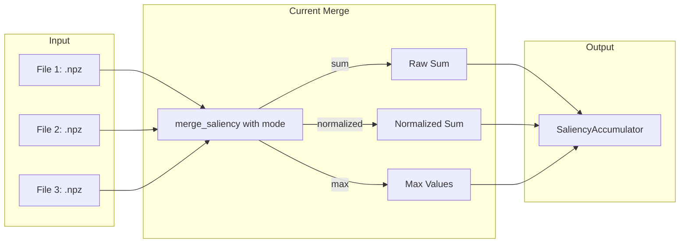
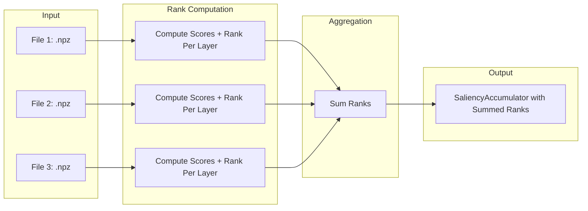

# Rank-Based Stat Merging Implementation Plan

## Overview

This plan outlines the implementation of a simplified rank-based merge strategy for saliency statistics. The goal is to replace the current three merge modes (sum, normalized, max) with a single rank-based approach that normalizes data across different datasets by computing per-layer rankings and summing them.

## Current State

### Existing Merge Modes in [`stats_ops.py`](src/mlx_fun/stats_ops.py:101)

| Mode | Description | Issue |
|------|-------------|-------|
| `sum` | Raw sum of all arrays | Larger datasets dominate |
| `normalized` | Normalize by sample count | Complex scaling logic |
| `max` | Keep maximum values | Only shows peaks, loses distribution info |

### Data Flow



## Proposed Solution

### Rank-Based Merge Algorithm

The new approach computes rankings per-layer for each input file, then sums the ranks:

1. **Load all files** into `SaliencyAccumulator` objects
2. **For each file**, compute scores using the specified metric (reap, ean, freq, weighted_freq)
3. **For each layer**, rank experts within that layer (rank 1 = highest score)
4. **Sum ranks** across all files for each (layer, expert) pair
5. **Store summed ranks** in a new `SaliencyAccumulator`

### Why This Works

- **Normalization**: Ranking removes scale differences between datasets
- **Equal weight**: Each dataset contributes equally (1 rank per position)
- **Interpretability**: Lower summed rank = consistently higher activation across datasets
- **Simplicity**: Single mode, no configuration needed

### Data Flow After Changes



## Implementation Details

### 1. Modified [`merge_saliency`](src/mlx_fun/stats_ops.py:101) Function

```python
def merge_saliency(
    files: List[str],
    metric: str = "reap",
) -> SaliencyAccumulator:
    """Merge multiple SaliencyAccumulator files using rank-based aggregation.

    For each file:
    1. Compute scores using the specified metric
    2. Rank experts within each layer (rank 1 = highest score)
    
    Then sum ranks across all files. Lower summed rank = more important expert.

    Args:
        files: List of paths to .npz files containing SaliencyAccumulator data.
        metric: Saliency metric to use for ranking (reap, ean, freq, weighted_freq).

    Returns:
        Merged SaliencyAccumulator with summed ranks stored in freq array.
        Lower values indicate higher importance.
    """
```

### 2. Ranking Logic

```python
def _compute_ranked_scores(acc: SaliencyAccumulator, metric: str) -> np.ndarray:
    """Compute per-layer rankings for an accumulator.
    
    Args:
        acc: SaliencyAccumulator to rank.
        metric: Metric to use for ranking.
        
    Returns:
        (num_layers, num_experts) array of ranks. Rank 1 = highest score.
    """
    scores = acc.compute_scores(metric)
    ranks = np.zeros_like(scores)
    
    for layer_idx in range(acc.num_layers):
        layer_scores = scores[layer_idx]
        # argsort gives indices that would sort the array
        # we want rank 1 for highest score, so we negate
        sorted_indices = np.argsort(-layer_scores)
        # Create ranking: position in sorted array + 1
        for rank, idx in enumerate(sorted_indices, 1):
            ranks[layer_idx, idx] = rank
    
    return ranks
```

### 3. Storage Consideration

The summed ranks will be stored in the `freq` array of the merged `SaliencyAccumulator`. This is because:
- Ranks are integer counts, similar to frequency
- The `freq` array is the most intuitive fit
- Other arrays (reap_sum, ean_sum, etc.) will be zeroed

**Note**: Users should use `compute_scores("freq")` to get the summed ranks. Lower values = more important.

## Files to Modify

| File | Changes |
|------|---------|
| [`src/mlx_fun/stats_ops.py`](src/mlx_fun/stats_ops.py) | Replace merge_saliency with rank-based implementation |
| [`src/mlx_fun/cli.py`](src/mlx_fun/cli.py:845) | Remove --mode option from stats-merge command |
| [`src/mlx_fun/frontend.py`](src/mlx_fun/frontend.py:627) | Simplify merge UI, remove mode comparison |
| [`test_merge_modes.py`](test_merge_modes.py) | Update to test rank-based merge |
| [`explain_merge_modes.py`](explain_merge_modes.py) | Remove or repurpose for rank explanation |
| [`README.md`](README.md) | Update documentation |

## API Changes

### Before

```bash
# CLI
mlx-fun stats-merge --files data/1.npz --files data/2.npz --output merged.npz --mode normalized
```

### After

```bash
# CLI
mlx-fun stats-merge --files data/1.npz --files data/2.npz --output merged.npz --metric reap
```

### Python API

```python
# Before
merged = merge_saliency(files, mode="normalized")

# After
merged = merge_saliency(files, metric="reap")
```

## Testing Strategy

1. **Unit tests** for `_compute_ranked_scores` function
2. **Unit tests** for `merge_saliency` with multiple files
3. **Integration test** verifying rank aggregation produces expected results
4. **Edge cases**:
   - Single file (ranks should still be computed)
   - Files with different activation patterns
   - Experts with zero activation

## Migration Notes

- **Breaking change**: The `mode` parameter is removed
- **Output interpretation**: Lower values now mean more important (opposite of before)
- **Metric parameter**: Now determines what is ranked, not how to merge

## Questions Resolved

1. **Ranking scope**: Per-layer (experts ranked within each layer separately) ✓
2. **Aggregation**: Lower sum = higher importance ✓
3. **Output format**: Summed ranks as integers ✓
4. **Mode removal**: Keep only rank mode, remove sum/normalized/max ✓
